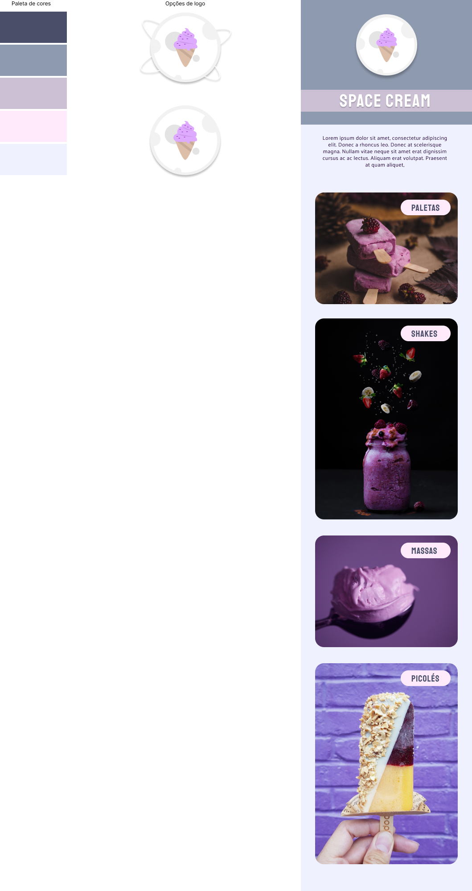

  

  

## 🖥️ Projeto
Esse é um projeto web de onde feito uma pagina para uma sorveteria aplicando a tecnica de mobile first, ou seja, site feito para dispositivos móveis.

## 🚀 Tecnologias
Esse projeto foi desenvolvido durante o curos de Explore da Rocketsat com as seguintes tecnologias:

- HTML
- CSS
- GIT E GITHUB
- FIGMA

## 🏷️layout
Você pode visualizar o layout do projeto através 
[desse link](https://www.figma.com/file/FzXgi9k7gCp5FHJLtbtFmL/Stage-03---Mobile-First-(Copy)?type=design&node-id=12-137&mode=design&t=355MOJzz9vb8cfWy-0).
É necessario ter uma conta no [Figma](https://www.figma.com).